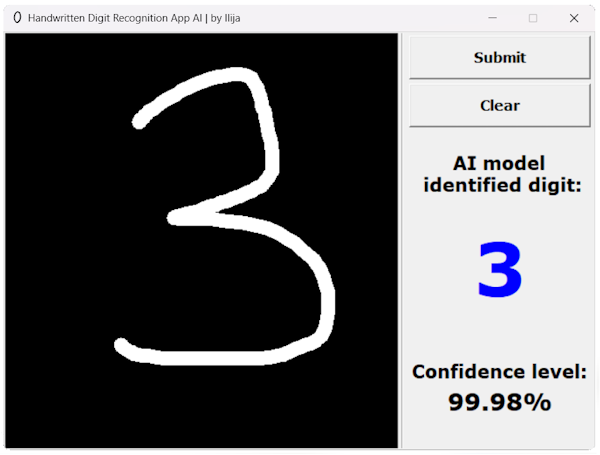
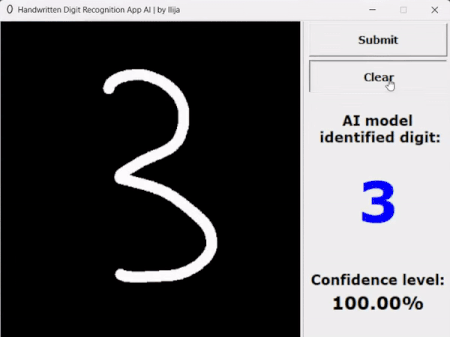

# Handwritten Digit Recognition App

The Handwritten Digit Recognition App is a simple Python application that allows users to draw a digit on a canvas,
and an AI model will identify the drawn digit and provide a prediction along with a confidence level.
The app has been implemented using the Tkinter library for the graphical user interface (GUI) and TensorFlow
for deep learning-based digit recognition.

## Demonstration Snippet

## Features

* **Drawing Canvas**: The app provides a canvas where users can draw a digit using their mouse or touchpad.

* **Digit Recognition**: Once the user submits the drawing, the AI model predicts the digit represented in the drawing
and displays the prediction.

* **Confidence Level**: The program also displays the confidence level of the model's prediction,
giving users an idea of how confident the model is in its prediction.

* **Clear Canvas**: Users can clear the canvas and start over if they wish to redraw the digit.

## Model

The app uses a pre-trained deep learning model to recognize handwritten digits, which can be found 
[here](https://github.com/th0tmaker/PyMachineLearning/blob/master/Handwritten%20Digit%20Classification(MNIST)/model.py)

## In Conclusion 
A simple and interactive way to showcase digit recognition using deep learning,
with a focus on providing an intuitive user interface.

## Author

The Handwritten Digit Recognition App was developed by [th0tmaker](https://github.com/th0tmaker) -
*"makeshift developer and maker of thots!"*

## License

This project is licensed under the terms of the MIT License. The MIT License is a permissive open source license that
allows you to freely use, modify, and distribute this software. It provides you with the freedom to adapt the code to
your needs, incorporate it into other projects, and use it for commercial purposes. The only requirement is to include
the original copyright and license notice in any copies or derivatives of the software.
